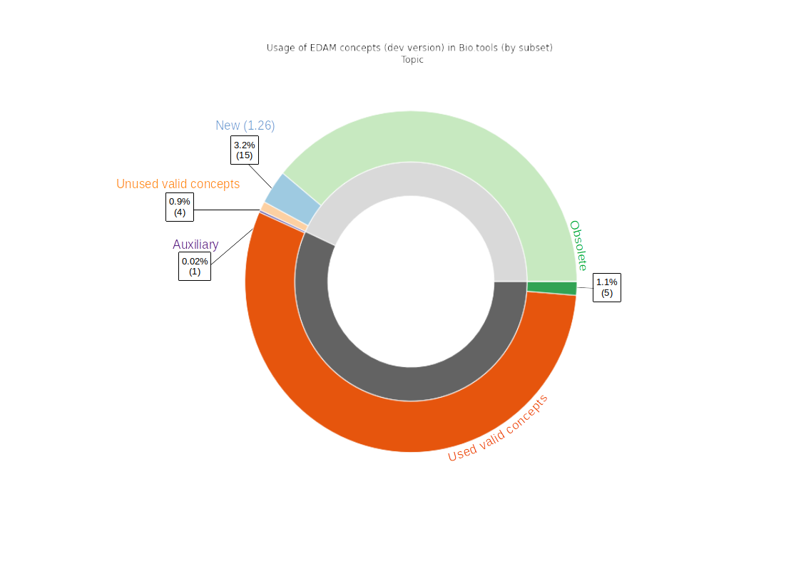
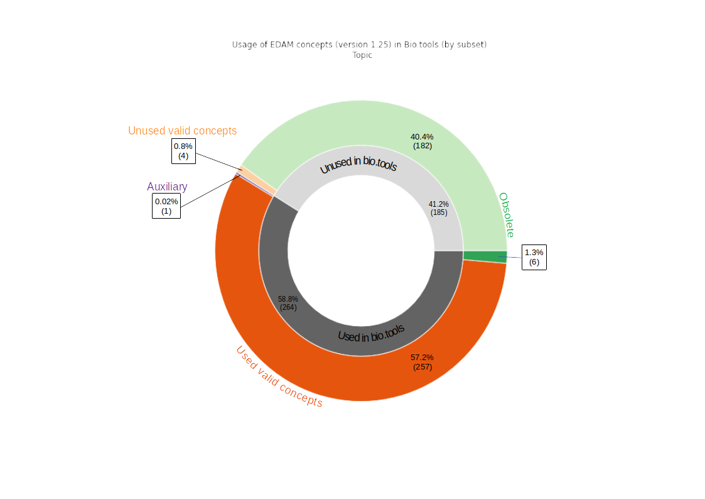

# Introduction

The Tools Ecosystem is a centralized repository for the open and transparent exchange of metadata about software tools and services in bioinformatics and life sciences.
It serves as the foundation for the sustainability of the diverse Tools Platform services, and for the interoperability between all these essential services (bio.tools [@usesDataFrom:Ison2019], BioContainers [@usesDataFrom:10.1093/bioinformatics/btx192], OpenEBench, Bioconda, WorkflowHub, usegalaxy.eu) and related resources outside of the ELIXIR Tools Platform (e.g. Bioschemas).

The goal of this project is to cross-compare and analyze the metadata centralized in the Tools Ecosystem to maintain high quality descriptions, together with the EDAM ontology [@providesDataFor:10.1093/bioinformatics/btt113] linked used for many annotations of these resources. In order to achieve these goals we need to design tools and processes that detect curation bottlenecks, perform rigorous data cross-validation, and generate detailed reporting about potential issues and actionable items.

We present here in a first section the results of these analyses, and in a second section the methods and approach we used, before to discuss potential perspectives for improved monitoring and curation of the Tools Ecosystem metadata and EDAM, as well as the insights to the .

# Results and discussion

## EDAM usage in bio.tools

For each section of the ontology (topic, operation, data, format) a nested pie plot displays the usage of concepts for annotating biotools entries. For each section a plot is displayed using the version 1.25  of EDAM and a another using the development version of EDAM. In the latest the new concepts are highleted as they are not available for annotation usage in bio.tools. 

**Vocab:**

Auxiliary concepts: concepts annotated with the property "notRecommandedForAnnotation". This concept are usually placeholders to organize other sub-concepts and should not be use to annotate

Valid concepts: concepts which are neither deprecated, from the newest 1.26 development version (not implemented in bio.tools) nor auxiliary. 

New concepts: concepts added to the ontology in the current development version (future 1.26)

### Topic:

  

### Operation:

  

Comment: All auxiliary operations are used to annotate tools. We should curate EDAM to remove the "notRecommandedForAnnotation" for rightfully used concepts.

### Data:

Here only one plot is shown as no new data concepts are currently added to the dev version of EDAM. 

### Format:

  

Comments data and format: 

For the data and format section, a large number of valid concepts, respectively 343 (23%) and 333 (45.2%), are not used in bio.tools. This can be related to the poor annotation level of tools with data and format as either input or output and may be caused by the addition of tools via textmining of the literature (pub2tool ref), that only suggest annotation with EDAM operations and topics. This could also be caused by an interface issue when adding the tool's annotation with EDAM concepts in bio.tools. This could also highlight the presence of a large number of unnecessary data and format concept polluting the ontology, and could lead a curation of EDAM. 

For format more than half the auxiliary concepts are used to annotate. For data 46% of auxiliary concepts are used in bio.tools. We should investigate to identify where this usage error is coming from. It could be EDAM concepts that should not be tagged as auxiliary, missing subconcept in EDAM that could replace the usage of the auxiliary concept, or a wrong annotation of the tool. 

General comment: For each section of EDAM, deprecated concept are still used to annotate bio.tools entries (44 in total). (discussion on how to deal with deprecation in bio.tools?)

## bio.tools annotation completeness

     

83.3% of tools are annotated with both topic and operation, the most used annotation fir search in (is that right???). 

In the 297% of not annotated tools, a portion may be spam tools, this should be investigated. (perpective of queries to determine most likely spam tools)

96.2 % of tools are annotated with operation versus only 12.5% with input or output data (and as a consequence even less with format). All operations in EDAM are linked to a data via a "has_input" and a "has_ouput" relation (using inferences from parent concepts). This lack of annotation may not be a true problem for human user that can easily deduce input and output from operation but it can be a problem from the machine readability point of vue. Moreover, with proper annotation, automatic workflow generation could be conceivable using bio.tools metadata and other software metadata from the Ecosystem. A perpective could be that for each operation added to the tool's annotation, input and output would be suggested to the curator/author based on EDAM relation. The same could go for suggestion of format based on data (##see how many data are linked to format). For human user we could also have in the bio.tools interface a "suggested input/output" that would be displayed on the tool page but clearly identifed as an unverified annotation. 

## Tool function signatures

_a plot of the proportion of validated complete function signatures in bio.tools_

_a listing of the top 10 most erroneous function signatures in bio.tools_

## Mapping between WorflowHub and bio.tools

# Methods

To facilitate the analysis of the data extracted from the Tools Ecosystem and other resources, we decided to make them available in a SPARQL endpoint, a solution that enables the querying of RDF resources. The various resources uploaded to a GraphDB-based SPARQL endpoint include:
- the EDAM ontology [@providesDataFor:jon_ison_2020_3899895], available in its development version at https://raw.githubusercontent.com/edamontology/edamontology/main/EDAM_dev.owl.
- the bio.tools contents [@providesDataFor:Ison2019], available on the Tools Platform Ecosystem git repository as a Turtle-formatted BioSchemas [@providesMethodFor:gray2017bioschemas] file at https://raw.githubusercontent.com/bio-tools/content/master/datasets/bioschemas-dump.ttl.
- (add something here about the WorkflowHub [@usesDataFrom:carole_goble_2021_4605654] dump provided by Johan and Alban).

The analysis of the data is performed using SPARQL queries, which are performed using a number of Jupyter notebooks. The various results are visualized using python libraries such as matplotlib ~~and R packages~~.

## Mapping between WorflowHub and bio.tools

# Perspectives

## SPARQL endpoint

For this project we decided to turn to a commercial solution to query EDAM and bio.tools datasets. GraphDB has the advatage of being easily set up by anyone. In the future we will provide a publicly available SPARQL endpoint using an opensource software (e.g Virtuoso). The goal would be for anyone to be able to query all datasets (for now EDAM and bio.tools but other datasets will be generated in the future) and our queries to be run periodically. It could also be used to improve EDAM CI tool (add ref to caseologue). 

## EDAM and Bio.tools analysis

- Base ground set, lots of analysis to come
- Identified Curation tasks
- Graphs and queries periodically updated and uploaded for maintainers and public. 
- 

## Mapping between WorflowHub and bio.tools

# Code availability

The code described to run the analyses and obtain the results presented here is freely available [on GitHub](https://github.com/bio-tools/biohackathon2022). The data collected are also freely available on the [Tools Ecosystem main repository](https://github.com/bio-tools/content/) and on the [EDAM repository](https://github.com/edamontology/edamontology/).

## Acknowledgements
This work was funded/supported by ELIXIR, the research infrastructure for life-science data.

## References
