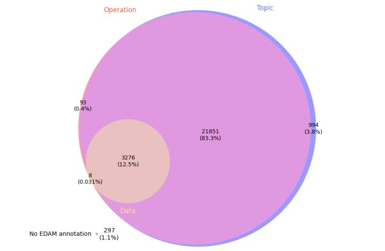
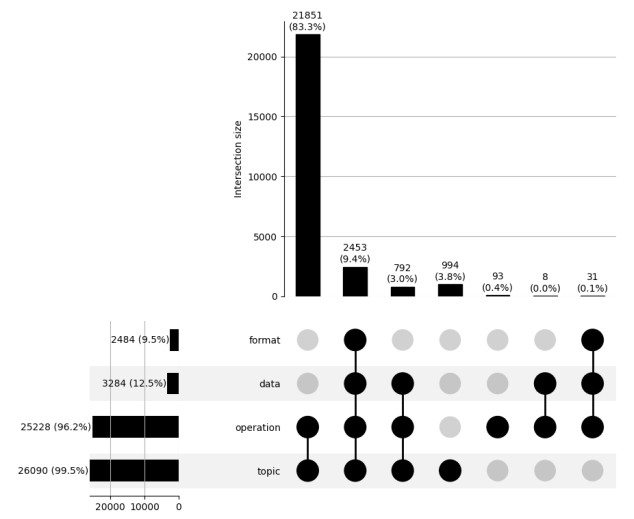
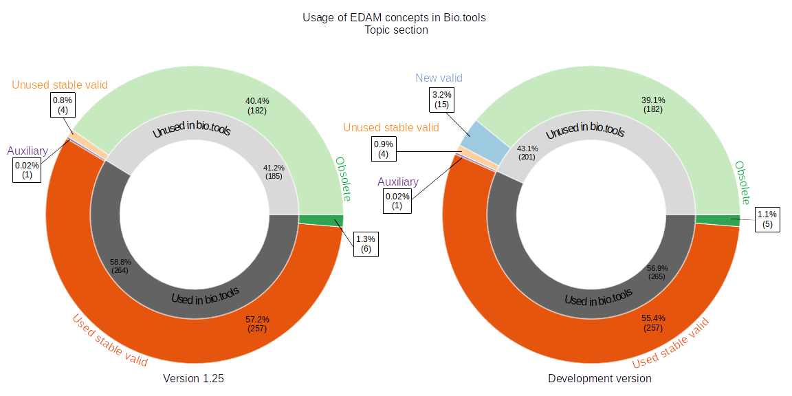
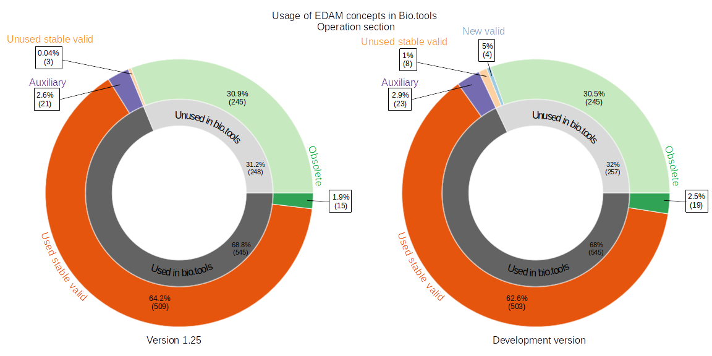
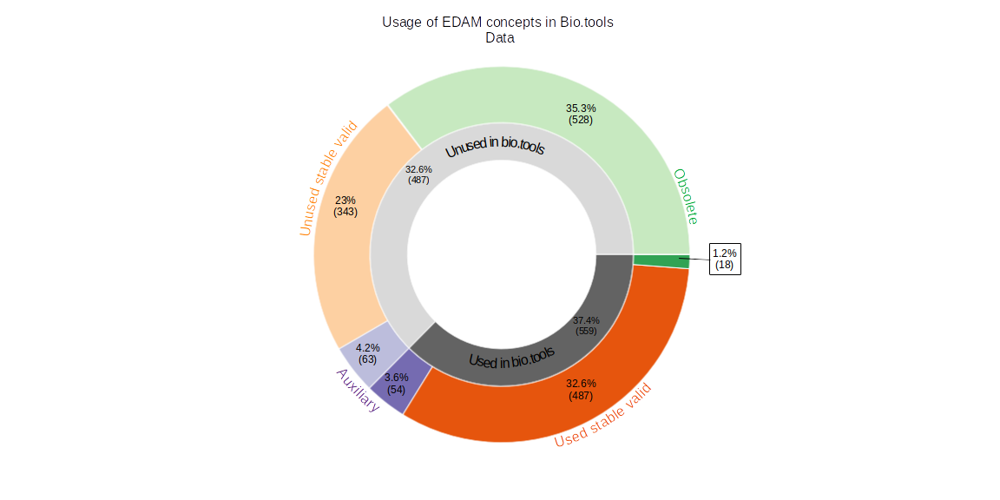
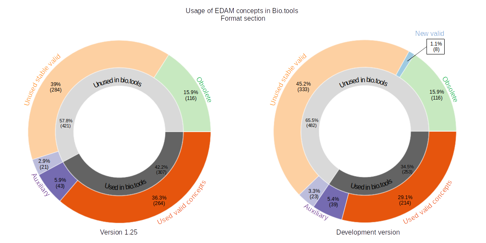
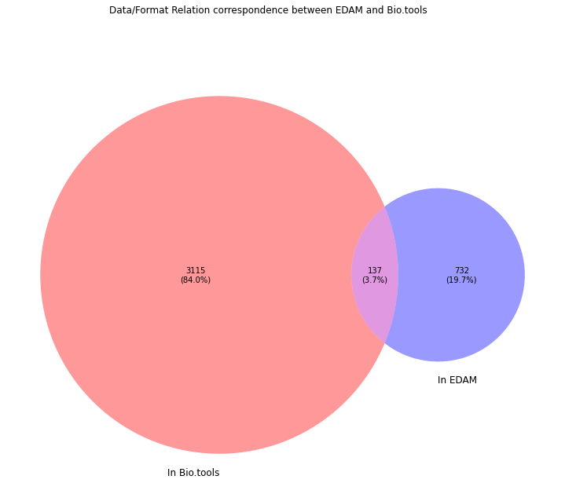

# Introduction

The [Tools Ecosystem](https://github.com/bio-tools/content/) is a centralized repository for the open and transparent exchange of metadata about software tools and services in bioinformatics and life sciences. It serves as a foundation for the sustainability and interoperability of the diverse Tools Platform services: bio.tools [@usesDataFrom:Ison2019], BioContainers [@usesDataFrom:10.1093/bioinformatics/btx192], OpenEBench [@usesDataFrom:openebench], Bioconda [@usesDataFrom:bioconda], WorkflowHub [@usesDataFrom:workflowhub], usegalaxy.eu [@usesDataFrom:galaxy]. It also includes a number of related resources outside of the ELIXIR Tools Platform (e.g. Debian Med, biii.eu).

Here we report the results of a project started at the [BioHackathon Europe 2022](https://biohackathon-europe.org/). Its goal is to cross-compare and analyze the metadata centralized in the Tools Ecosystem, together with the EDAM ontology [@providesDataFor:10.1093/bioinformatics/btt113] links used for many annotations of these resources. We present here in a first section the results of these analyses, and in a second section the methods and approach we used, before to discuss potential perspectives for improved monitoring and curation of the Tools Ecosystem metadata and EDAM.

# Results and discussion

## Semantic annotation of bio.tools entries of EDAM

Here we assess the completeness of the annotation of bio.tools entries with EDAM concepts. The two figures 1a and 1b represent the respective proportions of entries annotated with EDAM topics, operations, data and formats. 

{width=90%}
Figure 1a: bio.tools entries annotation represented as a Venn Diagram. Each set here represents the proportion of entries annotated with EDAM topics, operations and data. Overlap areas indicate the proportion of bio.tools entries annotated with e.g. both topics and operations, or topics, operations, and data.

{width=100%}
Figure 1b: bio.tools entries annotation represented as an upset plot. Each line represents the proportion of entries annotated with EDAM topics, operations, data and formats. Columns indicate the proportion of bio.tools entries for each combination of intersections (e.g. proportion of entries annotated with topics and operations).

These results show that most entries (83.3%) are annotated with topics and operations, and another significant portion (9.4%) also includes data and format concepts. Only a very small proportion of the entries (1.1%) do not include any EDAM annotation. The explanation for the important proportion of annotated entries is probably that EDAM topics and operations can be specified either by human contributors and curators, but is also the result of an automated text-mining process [@jaaniso2016automatic]. This level of annotation, with 96.2% of the tools including operation annotations, means that for almost all entries the scientific functions of the tools is described. Although only a significantly smaller proportion includes EDAM data for inputs and outputs, these could be automatically determined using the EDAM relations has_input and has_output between operations and data.

## EDAM usage in bio.tools

The analyses in this section assess the usage of EDAM concepts in bio.tools for each of its four sections. We first evaluate the proportion of the EDAM concepts used to annotate entries, and then relate their usage to their suitability for annotation: some EDAM concepts, obsolete or auxiliary, should not be used for annotations. 

This usage analysis has been performed with two versions of EDAM: the last stable release (1.25) currently used in bio.tools, and the current development version (commit hash: 38f21c1edf839efa5d957395f9495562cc7dc1f8). The comparison of these two versions allows to foresee the impact of the future release of EDAM on bio.tools annotations.

The goal of this approach is mainly to provide a first assessment on the fitness EDAM and bio.tools, i.e. evaluate whether the space of scientific concepts available in EDAM is adapted to the semantic description of bio.tools entries, and highlight some curation priorities.

**EDAM Concept categories**

Each of the different EDAM sections analysed here are separated into the following categories: 

- *Obsolete concepts*: concepts that are judged to be obsolete in the current version. They are marked as deprecated but can still be referenced with their URI.

- *Auxiliary concepts*: concepts which are usually placeholders to organize other sub-concepts and should not be used for annotation purposes. Technically speaking, these are identified using the "notRecommendedForAnnotation" property.

- *Valid concepts*: concepts which are valid for annotation (neither deprecated, nor auxiliary). 

- *New (valid) concepts*: concepts added to the ontology in the current development version (future 1.26).

### Topics:

{width=100%}
Figure 2: Usage of EDAM Topic concepts in bio.tools

As shown in Figure 2, EDAM topics usage in bio.tools reveals no major anomaly, most of the *valid topics* from version 1.25 being used in EDAM, whereas *obsolete* concepts are only marginally present in annotations. This could optimistically be interpreted as the indication of the fitness for the use of EDAM topics in bio.tools. However, this result doesn't guaranty that the topics section is extensive or precise enough, as some concepts can be used as default for lack of a better one.

### Operations:

{width=100%}
Figure 3: Usage of EDAM Operation concepts in bio.tools

Figure 3 displays the same tendencies for EDAM operations, with an overall wide usage of *valid operations* while *obsolete* ones are mostly unused. However, a frequent issue is the use of *auxiliary* concepts. Although such annotations are probably accurate (i.e. consistent with the scientific function performed by the tool), the usage of such concepts is usually discouraged as they are either too broad or reserved for internal structural purposes. The status of some auxiliary concepts from EDAM might however be revised, if such concepts are the most relevant for annotation. 

### Data and Formats:

{width=100%}
Figure 4: Usage of EDAM data concepts in bio.tools _(only one plot is shown as no new data concepts have been added to the current development version of EDAM)_ 

{width=100%}
Figure 5: Usage of EDAM format concepts in bio.tools

In contrast with the usage of topics and operations, a large proportion of data (23%) and formats (45.2%) are not used in bio.tools. Further investigation will be needed to determine this low usage is a consequence of annotation issues, or whether it is justified. Potential explanations include:

* a lower level of bio.tools EDAM annotation with data and formats, probably linked to the lack of data/format annotations in text-mining created entries.
* a scope difference between EDAM data and formats and bio.tools, as e.g. a number of EDAM formats might not be relevant in the scientific scope of bio.tools.
* the irrelevance of "legacy" formats related to life sciences technologies and tools which are now deprecated. It is important to note that such legacy file formats cannot be automatically deprecated as they are still used by older tools and can still be found in databases. This may explain the lack of usage of some valid formats in bio.tools. 

## Relations between concepts 

In EDAM concepts can be linked  with "relations" such as "has_output" linking an operation and a data concept, "has_topic" linking a data or a operation to a topic concept, or "is_format_of" linking a format to a data concept.

Here we will only study the "is_format_of" relation. 

{width=100%}

84% of relations in bio.tools are unconfirmed in EDAM. This need to be investigated. For the 19.7% inconsistent relation in EDAM, it may be caused by the inferences generated by the parent/children relation between classes. When A is parent of B, if A is related to C then B is related to C. This does not exclude B of having a relation with another, more precise, concept. Some of the relation may be unused because too wide, the specification of the children concept may be more used. 

Table: Most used relation in Bio.tools, unconfirmed by EDAM

|format|label format|data|label data|count|
|:---:|:---:|:---:|:---:|:---:|
|http://edamontology.org/format_2330|Textual format|http://edamontology.org/data_0006|Data|171|
|http://edamontology.org/format_1929|FASTA|http://edamontology.org/data_2044|Sequence|135|
|http://edamontology.org/format_3475|TSV|http://edamontology.org/data_0006|Data|128|
|http://edamontology.org/format_1476|PDB|http://edamontology.org/data_1460|Protein structure|89|
|http://edamontology.org/format_1929|FASTA|http://edamontology.org/data_2976|Protein sequence|89|
|http://edamontology.org/format_1929|FASTA|http://edamontology.org/data_0006|Data|82|
|http://edamontology.org/format_2330|Textual format|http://edamontology.org/data_2048|Report|74|
|http://edamontology.org/format_2330|Textual format|http://edamontology.org/data_2884|Plot|72|
|http://edamontology.org/format_2330|Textual format|http://edamontology.org/data_0863|Sequence alignment|68|
|http://edamontology.org/format_2573|SAM|http://edamontology.org/data_0006|Data|51|

This table shows that both Bio.tools are responsible for the inconsistency between both datasets. Four of these relation involve "Data" which is "notRecommendedForAnnotation" and should not be used. Some should be implemented in EDAM such as relation between "PDB" and "Protein Sequence" or "FASTA" and, "Sequence" and "Protein sequence". For the "Textual format" and "Plot" relation, it seems that for most cases the "Plot" data is associated in bio.tools with several format including "Textual format". It seems that for some cases only the "PDF" of "Image format" could be kept. 

## Mapping between WorkflowHub and bio.tools

Here, we sought to explore whether the understanding of bio.tools and EDAM could be extended to include [WorkflowHub](https://workflowhub.eu/), and the future implications of this mapping for each of the three resources. WorkflowHub allows developers to register workflows, each of which are composed of one or more software tools. The connection to bio.tools is clear, and one can imagine a scenario where a workflow registered in WorkflowHub:

1. Has component tools automatically extracted (as is the case currently for Galaxy); 
2. Each tool has a bio.tools identifier;
3. This identifier allows WorkflowHub to import and present bio.tools annotations in workflow entries;
4. WorkflowHub can filter workflows based on both EDAM terms (currently available) and bio.tools identifiers; and
5. bio.tools can perform the reverse operation and import metadata about workflows that use specific bio.tools entries

To link WorkflowHub and bio.tools entries, an example set of Galaxy workflows from WorkflowHub (https://workflowhub.eu/workflows) was selected and a map was created between the entries in this space and Galaxy Australia & Galaxy Europe tool identifiers (see methods section for details). This ultimately provided WorkflowHub identifiers as dictionary keys for lists of bio.tools identifiers.

### Results

|                Metric               | Value |
|-------------------------------------|:-----:|
|No. of tools WITH a bio.tools ID     |   399  |
|No. of tools without a bio.tools ID  |   200  |
|Total no. of tools for all workflows |  599  |

The results of the mapping revealed that for 599 tools used across 80 workflows, 399 tools had a bio.tools identifier ( 67% ). Note that this does not mean that in each case a biotools identifier does not exist. It is also possible that the identifier exists but that it still needs to be added to the Galaxy tool metadata. For example, `hifiasm` is used by the workflow `PacBio HiFi genome assembly using hifiasm` (https://workflowhub.eu/workflows/221). This tool has a bio.tools identifier (https://bio.tools/hifiasm), which could be added to the Galaxy tool wrapper.

The table below shows the WorkflowHub identifier, the workflow urls and the bio.tools identifiers extracted from 10 of these workflows. 

| WorkflowHub ID 	|      url    	| 		bio.tools IDs 		|
|:---------------:|:--------------------:|:-------------------------:|
| 138  | [url](https://workflowhub.eu/workflows/138) |  bedtools, bx-python, bx-python, bx-python, bcftools |
| 221  | [url](https://workflowhub.eu/workflows/221) | hifiadapterfilt, bandage, bandage |
| 395  | [url](https://workflowhub.eu/workflows/395) |  cutadapt, bowtie2, samtools, bedtools, macs, multiqc | 
| 397  | [url](https://workflowhub.eu/workflows/397) |  cutadapt, bowtie2, samtools, macs, multiqc |
| 398  | [url](https://workflowhub.eu/workflows/398) |  cutadapt, bowtie2, samtools, macs, multiqc |
| 399  | [url](https://workflowhub.eu/workflows/399) |  cutadapt, bowtie2, samtools, bedtools, seqcode, samtools, macs, bedtools, bedtools, bedtools, multiqc |
| 400  | [url](https://workflowhub.eu/workflows/400) |  cutadapt,  star,  multiqc, cufflinks, bedtools, cutadapt, star, multiqc, cufflinks, bedtools |
| 403  | [url](https://workflowhub.eu/workflows/403) |  quast, busco, merqury |
| 406  | [url](https://workflowhub.eu/workflows/406) |  nanoplot, minimap2, Racon, unicycler, miniasm, bandage, staramr |
| 407  | [url](https://workflowhub.eu/workflows/407) |  bbmap, shovill, bwa, pilon, mob-suite, SISTR |

This dictionary was used as an input to ______________________.

# Methods

To facilitate the analysis of the data extracted from the Tools Ecosystem and other resources, we decided to make them available in a SPARQL endpoint, a solution that enables the querying of RDF resources. The various resources uploaded to a GraphDB-based SPARQL endpoint include:
- the EDAM ontology [@providesDataFor:jon_ison_2020_3899895], available in its development version at https://raw.githubusercontent.com/edamontology/edamontology/main/EDAM_dev.owl.
- the bio.tools contents [@providesDataFor:Ison2019], available on the Tools Platform Ecosystem git repository as a Turtle-formatted BioSchemas [@providesMethodFor:gray2017bioschemas] file at https://raw.githubusercontent.com/bio-tools/content/master/datasets/bioschemas-dump.ttl.
- (add something here about the WorkflowHub [@usesDataFrom:carole_goble_2021_4605654] dump provided by Johan and Alban).

The analysis of the data is performed using SPARQL queries, which are performed using a number of Jupyter notebooks. The various results are visualized using python libraries such as matplotlib.

## Mapping between WorkflowHub and bio.tools

The functions for mapping between WorkflowHub and bio.tools:

1. Access the WorkflowHub API for a specific space (Australian BioCommons, https://workflowhub.eu/programmes/8/workflows);
2. Collect all workflow metadata for this space;
3. Filter these metadata for Galaxy workflows only;
4. For each workflow, extract all workflow step numbers and Galaxy identifiers;
5. Use the Galaxy identifiers to access the Galaxy API and extract, where available, bio.tools identifiers
6. _______________

The functions described are available here: https://github.com/bio-tools/biohackathon2022/blob/e154302bb974fe63c3abbb0c757cab04cd49b47e/scripts/workflowhub_galaxy_biotools.py

# Perspectives

_Eventually, we expect to get a better understanding of these metadata and their relations, and improve them by designing tools and processes that detect curation bottlenecks, perform rigorous data cross-validation, and generate detailed reporting about potential issues and actionable items._

## SPARQL endpoint

For this project we adopted the [GraphDB commercial software](https://graphdb.ontotext.com/) to store query EDAM and bio.tools datasets. GraphDB has the advatage of being easily set up by anyone. In the future we will provide a publicly available SPARQL endpoint using an opensource software (e.g Virtuoso). The goal would be for anyone to be able to query all datasets (for now EDAM and bio.tools but other datasets will be generated in the future) and for our teams of maintainers to be able to run our queries periodically if needed. It could also be used to improve EDAM CI tool (add ref to caseologue) as it is run using the RDFlib library which is not the most efficient. 

## EDAM and Bio.tools analysis

With our work during this 2022 Biohackathon we created and tested a valid work environment for analysing the EDAM onology and the Bio.tools registry. This work is only the beginning as, in the same fashion, other registry of the Tools Ecosystem will soon be available for analysis. Thanks to our first query base we can easily imagine building on them to be able to evaluate and enhance metadata from the whole Ecosystem. Further more we could to do so automatically to track progress using appropriate graphic displays. Such graphics could be very useful for both maintainers and the Ecosystem tools communities and users. 

This first round of analysis left us with some identified curation tasks for both EDAM and bio.tools that should be investigated in the future, as discussed in the Results and Discussion. Moreover some potential enhancement were identified. During our analysis we found our self wondering about the bio.tools entries annotation provenance, from pub2tool of manually added. This could be an interesting addition to bio.tools entries metadata. 

This work also raised the question of the handling of deprecation in bio.tools. As of 2022, deprecated terms are not removed from the bio.tools annotation. This cannot be properly handled automatically and would be too time consuming manually. In EDAM, when deprecating a term, one of "replacedBy" or "consider" property must be added. "ReplacedBy" concept could be used as automatic replacement for deprecated term but "consider" would need manual validation. 
=> text mining? 

To resolve the lack of annotation of bio.tools entries using data and format concepts from EDAM, a perpective could be to improve bio.tools interface. All operations in EDAM are linked to a data via a "has_input" and a "has_output" relation (using inferences from parent concepts). For each operation added to the tool's annotation, input and output data would be suggested to the curator/author based on EDAM relation "has_input", "has_output". The same could go for suggestion of format based on its relation with data as 533 formats (over the 619 valid formats) are related to a data with the "is_format_of" relation. For human user we could also have in the bio.tools interface a "suggested input/output" that would be displayed on the tool page but clearly identifed as an unverified annotation. The enhancement of complete EDAM annotation could lead to automatic workflow generation using the whole Ecosystem metadata. 

## Mapping between WorkflowHub and bio.tools

Registered best practice workflows represent significant investments of researcher time and expertise: ideally these workflows would be able to draw directly on the wealth of metadata and ontology annotations (i.e. EDAM) stored by a registry like bio.tools, with minimal additional input of effort from a workflow developer. The prototype map described by this project is incomplete, with a third of Galaxy workflow tools not mapped, either due to missing annotations in the Galaxy tool wrappers or missing bio.tools registry entries. However, the potential value is already clear: a potential next step is for the map functions between WorkflowHub and Galaxy to be productionised by the Tools Ecosystem, such that bio.tools is able to access all Galaxy workflows on WorkflowHub (N = 126 in December 2022) that make use of bio.tools entries, and WorkflowHub is able to access tool components of its workflows as well as bio.tools registry metadata. Synchronisation in this manner will give each platform the opportunity to further improve the experience of users that contribute to and maintain a FAIR software ecosystem.

Many thousands of Galaxy workflows exist globally. With automated integration, users of WorkflowHub will be able to intuitively navigate the growing set of Galaxy workflows based on their tool of choice, topic, or software operation. 

# Code availability

The code described to run the analyses and obtain the results presented here is freely available [on GitHub](https://github.com/bio-tools/biohackathon2022). The data collected are also freely available on the [Tools Ecosystem main repository](https://github.com/bio-tools/content/) and on the [EDAM repository](https://github.com/edamontology/edamontology/).

## Acknowledgements
This work was funded/supported by ELIXIR, the research infrastructure for life-science data. This work was supported by the Australian BioCommons which is enabled by NCRIS via Bioplatforms Australia funding.

## References
