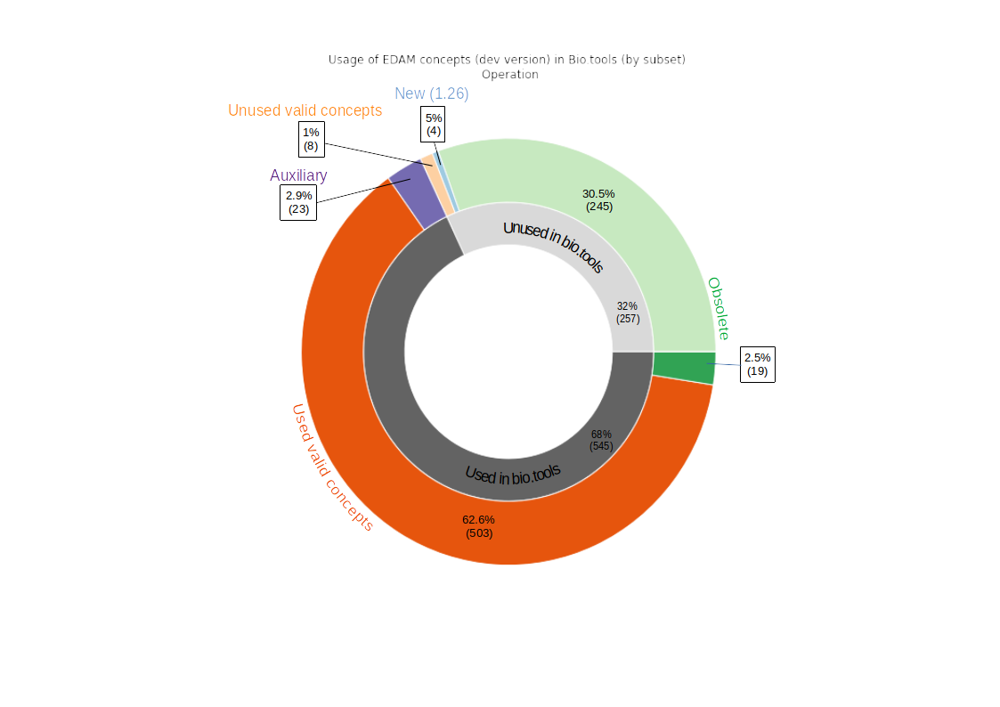
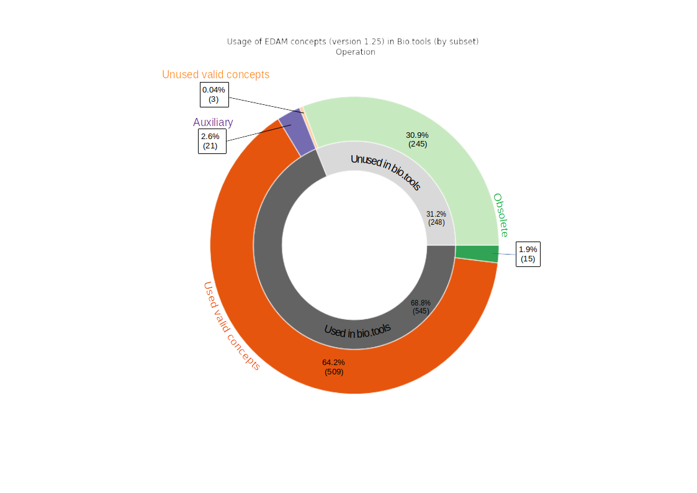
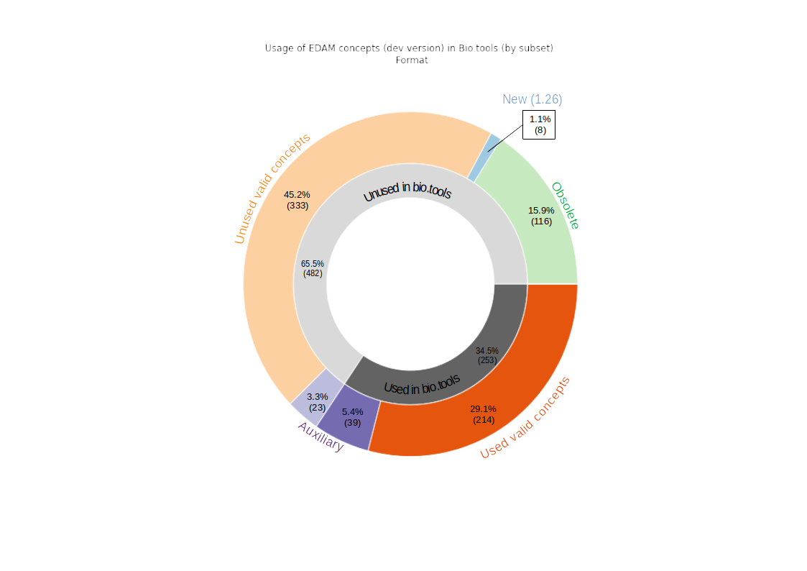
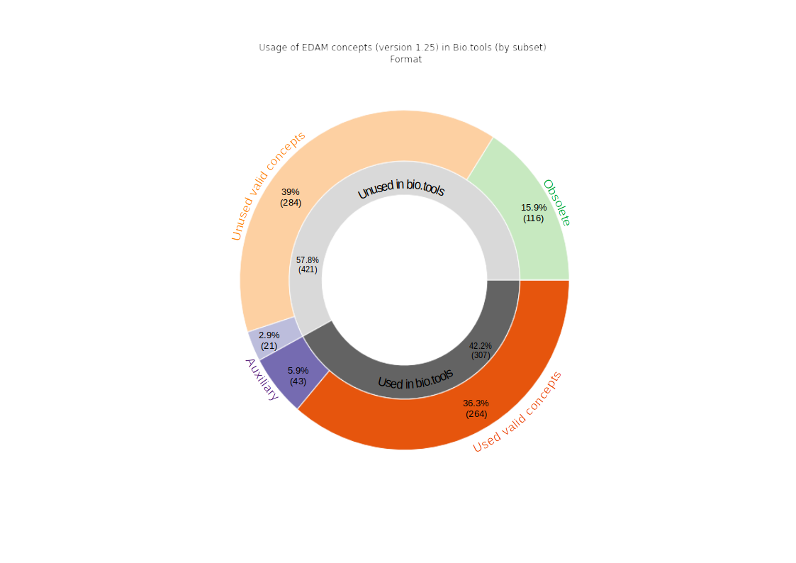
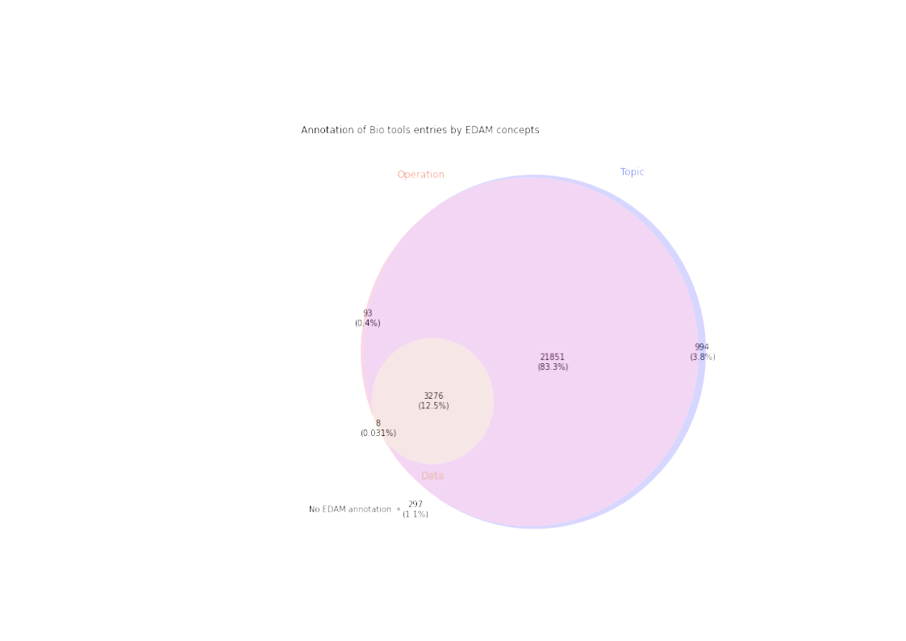
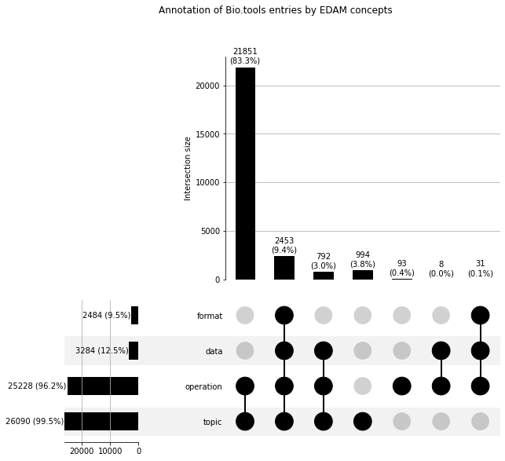

# Introduction

The Tools Ecosystem is a centralized repository for the open and transparent exchange of metadata about software tools and services in bioinformatics and life sciences.
It serves as the foundation for the sustainability of the diverse Tools Platform services, and for the interoperability between all these essential services (bio.tools [@usesDataFrom:Ison2019], BioContainers [@usesDataFrom:10.1093/bioinformatics/btx192], OpenEBench, Bioconda, WorkflowHub, usegalaxy.eu) and related resources outside of the ELIXIR Tools Platform (e.g. Bioschemas).

The goal of this project is to cross-compare and analyze the metadata centralized in the Tools Ecosystem to maintain high quality descriptions, together with the EDAM ontology [@providesDataFor:10.1093/bioinformatics/btt113] linked used for many annotations of these resources. In order to achieve these goals we need to design tools and processes that detect curation bottlenecks, perform rigorous data cross-validation, and generate detailed reporting about potential issues and actionable items.

We present here in a first section the results of these analyses, and in a second section the methods and approach we used, before to discuss potential perspectives for improved monitoring and curation of the Tools Ecosystem metadata and EDAM, as well as the insights to the .

# Results and discussion

## EDAM usage in bio.tools

For each section of the ontology (topic, operation, data, format) a nested pie plot displays the usage of concepts for annotating biotools entries. For each section a plot is displayed using the development version of EDAM and a another using the version 1.25 of EDAM. In the first, the new concepts are highleted as they are not available for annotation usage in bio.tools. 

**Vocab:**

Obsolete concepts: concepts that were juged to be obsolete in a later version but are not deleted from the owl ontology file. They are marked as deprecated but can still be referenced with their URI.

Auxiliary concepts: concepts annotated with the property "notRecommandedForAnnotation". This concept are usually placeholders to organize other sub-concepts and should not be use to annotate

Valid concepts: concepts which are neither deprecated, from the newest 1.26 development version (not implemented in bio.tools) nor auxiliary. 

New concepts: concepts added to the ontology in the current development version (future 1.26)

### Topic:

 

Almost all valid topics are used in the ontology. This could mean that EDAM is perfectly covering the needs of bio.tools users(, or they are too wide and the annotation are not precise enough. We need to investigate if more topics are needed. ## second part relevant?)

### Operation:

  

All auxiliary operations are used to annotate tools. We should curate EDAM to remove the "notRecommandedForAnnotation" property from the rightfully used concepts and seek the one that should stay auxiliary. Otherwise, in the same fashion as topics, almost all valid operations are used to annotate bio.tools. 

### Data and Format:

Here only one plot is shown as no new data concepts are currently added to the dev version of EDAM. 

  

Comments data and format: 

For the data and format section, a large number of valid concepts, respectively 343 (23%) and 333 (45.2%), are not used in bio.tools. This can be a consequence of the poor annotation level of tools with data and format as either input or output (see bellow). It may also be caused by the addition of tools via textmining of the literature (pub2tool ref), that only suggest annotation with EDAM operations and topics. Moreover, it may be a consequence of the interface layout when adding the tool's annotation with EDAM concepts in bio.tools. This could also highlight the presence of a large number of unnecessary data and format concept polluting the ontology, and could lead a curation of EDAM. 

For format more than half the auxiliary concepts are used to annotate. For data 46% of auxiliary concepts are used in bio.tools. We should investigate to identify where this usage error is coming from. It could be EDAM concepts that should not be tagged as auxiliary, missing subconcept in EDAM that could replace the usage of the wider auxiliary concept, or a wrong annotation of the tool. 

For formats, it seems that no obsolete concepts were used to annotate bio.tools entiries. It may be due to the low usage of format in bio.tools entires annotation (see bellow) or that all obsolete concepts were already unused when they were added to EDAM. 

General comment: For each section of EDAM, 44 deprecated concept are still used to annotate 1213 bio.tools entries. (discussion on how to deal with deprecation in bio.tools?)

## bio.tools annotation completeness

     

95.7% of tools are annotated with both topic and operation, the most used annotation for search in bio.tools (is that right???). This result is very encouraging.

In the 297 tools totaly missing EDAM annotation, a portion may be spam tools, this should be investigated. (perpective of queries to determine most likely spam tools)

96.2 % of tools are annotated with operation versus only 12.5% with input or output data (and as a consequence even less with format). All operations in EDAM are linked to a data via a "has_input" and a "has_ouput" relation (using inferences from parent concepts). This lack of annotation may not be a true problem for human user that can easily deduce input and output from operation but it can be a problem from the machine readability point of vue. Moreover, with proper annotation, automatic workflow generation could be conceivable using bio.tools metadata and other software metadata from the Ecosystem. A perpective could be that for each operation added to the tool's annotation, input and output would be suggested to the curator/author based on EDAM relation. The same could go for suggestion of format based on relation with data in EDAM. 533 formats (over the 619 valid formats) are related to a data with the "is_format_of" relation. For human user we could also have in the bio.tools interface a "suggested input/output" that would be displayed on the tool page but clearly identifed as an unverified annotation. 

## Tool function signatures

_a plot of the proportion of validated complete function signatures in bio.tools_

_a listing of the top 10 most erroneous function signatures in bio.tools_

## Mapping between WorkflowHub and bio.tools

Here, we sought to explore whether the understanding of bio.tools and EDAM could be extended to include [WorkflowHub](https://workflowhub.eu/), and the future implications of this mapping for each of the three resources. WorkflowHub allows developers to register workflows, each of which are composed of one or more software tools. The connection to bio.tools is clear, and one can imagine a scenario where a workflow registered in WorkflowHub:

1. Has component tools automatically extracted (as is the case currently for Galaxy); 
2. Each tool has a bio.tools identifier;
3. This identifier allows WorkflowHub to import and present bio.tools annotations in workflow entries;
4. WorkflowHub can filter workflows based on both EDAM terms (currently available) and bio.tools identifiers; and
5. bio.tools can perform the reverse operation and import metadata about workflows that use specific bio.tools entries

To link WorkflowHub and bio.tools entries, an example set of curated Galaxy workflows from the Australian BioCommons space (https://workflowhub.eu/programmes/8/workflows) was selected and a map was created between the entries in this space and Galaxy Australia tool identifiers (see methods section for details). This ultimately provided WorkflowHub identifiers as dictionary keys for lists of bio.tools identifiers.

### Results

|                Metric               | Value |
|-------------------------------------|:-----:|
|No. of tools WITH a bio.tools ID     |   28  |
|No. of tools without a bio.tools ID  |   82  |
|Total no. of tools for all workflows |  110  |

The results of the mapping revealed that for 110 tools used across 23 workflows, only 28 tools had a bio.tools identifier ( 25.5% ). Note that this does not mean that in each case a biotools identifier does not exist. It is also possible that the identifier exists but that it still needs to be added to the Galaxy tool metadata. For example, `hifiasm` is used by the workflow `PacBio HiFi genome assembly using hifiasm` (https://workflowhub.eu/workflows/221). This tool has a bio.tools identifier (https://bio.tools/hifiasm), which could be added to the Galaxy tool wrapper.

The table below shows the WorkflowHub identifier, the workflow urls and the bio.tools identifiers extracted from each workflow. 

| WorkflowHub ID 	|      url    									              | 		bio.tools ID 				          |
|:---------------:|:-------------------------------------------:|:---------------------------------:|
| 	220       		| [url](https://workflowhub.eu/workflows/220) | picard_samtofastq, fastqc 		    |
| 	221 	  		  | [url](https://workflowhub.eu/workflows/221) | hifiadapterfilt, bandage, bandage |
|	  222 			    | [url](https://workflowhub.eu/workflows/222) | fastqc, multiqc 					        |
| 	225 			    | [url](https://workflowhub.eu/workflows/225) | bandage, quast 					          |
| 	227 			    | [url](https://workflowhub.eu/workflows/227) | minimap2							            |
| 	228 			    | [url](https://workflowhub.eu/workflows/228) | minimap2 							            |
| 	229 			    | [url](https://workflowhub.eu/workflows/229) | busco, quast 						          |
| 	232 			    | [url](https://workflowhub.eu/workflows/232) | fastqc, pear 						          |
| 	233 			    | [url](https://workflowhub.eu/workflows/233) | fastqc 							              |
| 	237 			    | [url](https://workflowhub.eu/workflows/237) | purge_dups, minimap2 				      |
| 	346 			    | [url](https://workflowhub.eu/workflows/346) | fastqc, cutadapt, multiqc 		    |
| 	347 			    | [url](https://workflowhub.eu/workflows/347) | bwa-mem2, multiqc 				        |
| 	351 			    | [url](https://workflowhub.eu/workflows/351) | bwa-mem2, multiqc 				        |
| 	403 			    | [url](https://workflowhub.eu/workflows/403) | quast, busco,  merqury 			      |

This dictionary was used as an input to ______________________.

# Methods

To facilitate the analysis of the data extracted from the Tools Ecosystem and other resources, we decided to make them available in a SPARQL endpoint, a solution that enables the querying of RDF resources. The various resources uploaded to a GraphDB-based SPARQL endpoint include:
- the EDAM ontology [@providesDataFor:jon_ison_2020_3899895], available in its development version at https://raw.githubusercontent.com/edamontology/edamontology/main/EDAM_dev.owl.
- the bio.tools contents [@providesDataFor:Ison2019], available on the Tools Platform Ecosystem git repository as a Turtle-formatted BioSchemas [@providesMethodFor:gray2017bioschemas] file at https://raw.githubusercontent.com/bio-tools/content/master/datasets/bioschemas-dump.ttl.
- (add something here about the WorkflowHub [@usesDataFrom:carole_goble_2021_4605654] dump provided by Johan and Alban).

The analysis of the data is performed using SPARQL queries, which are performed using a number of Jupyter notebooks. The various results are visualized using python libraries such as matplotlib.

## Mapping between WorkflowHub and bio.tools

The functions for mapping between WorkflowHub and bio.tools:

1. Access the WorkflowHub API for a specific space (Australian BioCommons, https://workflowhub.eu/programmes/8/workflows);
2. Collect all workflow metadata for this space;
3. Filter these metadata for Galaxy workflows only;
4. For each workflow, extract all workflow step numbers and Galaxy identifiers;
5. Use the Galaxy identifiers to access the Galaxy API and extract, where available, bio.tools identifiers
6. _______________

The functions described are available here: https://github.com/bio-tools/biohackathon2022/blob/e154302bb974fe63c3abbb0c757cab04cd49b47e/scripts/workflowhub_galaxy_biotools.py

# Perspectives

## SPARQL endpoint

For this project we decided to turn to a commercial solution to query EDAM and bio.tools datasets. GraphDB has the advatage of being easily set up by anyone. In the future we will provide a publicly available SPARQL endpoint using an opensource software (e.g Virtuoso). The goal would be for anyone to be able to query all datasets (for now EDAM and bio.tools but other datasets will be generated in the future) and for our teams of maintainers to be able to run our queries periodically if needed. It could also be used to improve EDAM CI tool (add ref to caseologue) as it is run using the RDFlib library which is not the most efficient. 

## EDAM and Bio.tools analysis

- Base ground set if queries, lots of analysis to come
- Identified Curation tasks
- Graphs and queries periodically updated and uploaded for maintainers and public. 
- 

## Mapping between WorkflowHub and bio.tools

Although far from complete, the value of the mapping can already be seen. If this could be extrapolated to the growing number of Galaxy workflows on WorkflowHub (currently N = 126), it would be possible to filter workflows based on specific tools, or even combinations of tools.

# Code availability

The code described to run the analyses and obtain the results presented here is freely available [on GitHub](https://github.com/bio-tools/biohackathon2022). The data collected are also freely available on the [Tools Ecosystem main repository](https://github.com/bio-tools/content/) and on the [EDAM repository](https://github.com/edamontology/edamontology/).

## Acknowledgements
This work was funded/supported by ELIXIR, the research infrastructure for life-science data.

## References
