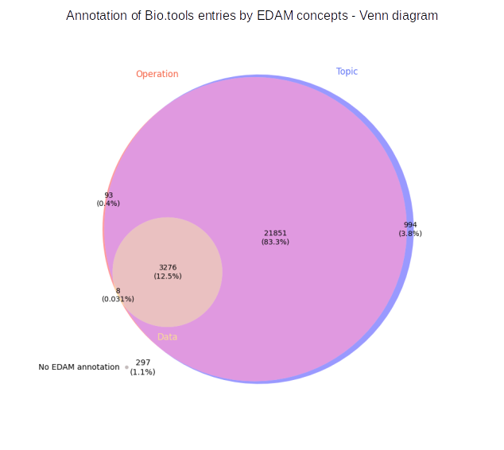
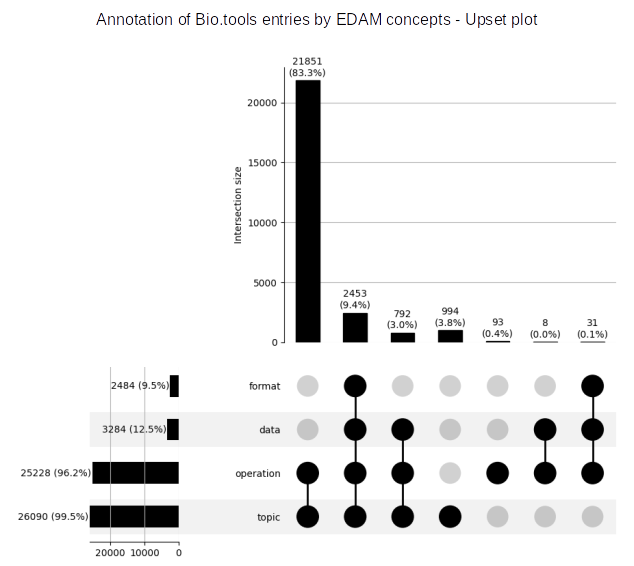

# Introduction

The [Tools Ecosystem](https://github.com/bio-tools/content/) is a centralized repository for the open and transparent exchange of metadata about software tools and services in bioinformatics and life sciences. It serves as a foundation for the sustainability of the diverse Tools Platform services, and for the interoperability between all these essential services: bio.tools [@usesDataFrom:Ison2019], BioContainers [@usesDataFrom:10.1093/bioinformatics/btx192], OpenEBench [@usesDataFrom:openebench], Bioconda [@usesDataFrom:bioconda], WorkflowHub [@usesDataFrom:workflowhub], usegalaxy.eu [@usesDataFrom:galaxy]. It also includes a number of related resources outside of the ELIXIR Tools Platform (e.g. Debian Med, biii.eu).

Here we report the results of a project started at the [BioHackathon Europe 2022](https://biohackathon-europe.org/). Its goal is to cross-compare and analyze the metadata centralized in the Tools Ecosystem, together with the EDAM ontology [@providesDataFor:10.1093/bioinformatics/btt113] links used for many annotations of these resources. We present here in a first section the results of these analyses, and in a second section the methods and approach we used, before to discuss potential perspectives for improved monitoring and curation of the Tools Ecosystem metadata and EDAM.

# Results and discussion

## EDAM usage in bio.tools

These analyses assess the usage of EDAM concepts in bio.tools for each of its four sections. We first evaluate the proportion of the EDAM concepts used to annotate entries, and second relate their usage status to their suitability for annotation: some EDAM concepts, obsolete or auxiliary, should not be used for annotations. 

This usage analysis has been performed each time with two versions of EDAM: the last stable release (1.25) currently used in bio.tools, and the current development version (commit hash: 38f21c1edf839efa5d957395f9495562cc7dc1f8): this allows to foresee the impact of the future release of EDAM on bio.tools annotations.

To analyze bio.tools, a Bioschemas dump has been generated using a json file for each tool, generated up to the beginning of 2022. A minor proportion of this information may be out of date compared to the bio.tools website at the time of the analysis, however the main tendencies are still relevant. 

This analysis allows us to asses the quality of EDAM and bio.tools and reveal some curation priorities to improve both datasets. Some of the results still need further analysis and for some only conjectures were drawn.

**EDAM Concept categories**

*Obsolete concepts*: concepts that are judged to be obsolete in the current version. They are marked as deprecated but can still be referenced with their URI.

*Auxiliary concepts*: concepts which are usually placeholders to organize other sub-concepts and should not be used for annotation purposes. Technically speaking, these are identified using the "notRecommendedForAnnotation" property.

*Valid concepts*: concepts which are valid for annotation (neither deprecated, nor auxiliary). 

*New (valid) concepts*: concepts added to the ontology in the current development version (future 1.26).

### Topics:

{width=100%}

Almost all valid topics are used in the ontology. This could mean that EDAM is perfectly covering the needs of bio.tools users. This result doesn't guaranty that the topic section is extensive or precise enough, as topics can be used as default for lack of better available concept. We need to investigate if more topics are needed.

=> Question the author of pub2tool to check for a methodological bias example if it wants to cover all topics are not ask  Erik Jaaniso @jaanisoe - erik.jaaniso@ut.ee

### Operations:

{width=100%}

All auxiliary operations are used to annotate tools. We should curate EDAM to remove the "notRecommendedForAnnotation" property from the rightfully used concepts and seek the one that should stay auxiliary. Otherwise, in the same fashion as topics, almost all valid operations are used to annotate bio.tools. 

=> pub2tool, can it annotate with auxiliary concept? 

### Data and Formats:

{width=100%}

Here only one plot is shown as no new data concepts are currently added to the dev version of EDAM. 

{width=100%}

For the data and format section, a large number of valid concepts, respectively 343 (23%) and 333 (45.2%), are not used in bio.tools. This can be a consequence of the poor annotation level of tools with data and format as either input or output (see below). It may be a consequence of the interface layout when adding the tool's annotation with EDAM concepts in bio.tools. This could also be explained by the fact that bio.tools doesn't cover as much of bioinformatics fields as EDAM. 

Moreover, for the data section, some subconcepts may be too precise for tools annotation and/or labels alone may not be self-explanatory enough. As an example, no tools are annotated with "Alpha diversity", "Beta diversity", and "Gamma diversity" whereas "Biodiversity data", their parent class and a more general concept, is used several times. 

Concerning formats, a file format that is not used by the "modern" scientific community cannot be automatically deprecated as it is still used by older tools and can still be found in databases. This may explain the lack of usage of some valid formats in bio.tools. 

=> does pub2tool mine older tools? otherwise this may also explain

For format more than half the auxiliary concepts are used to annotate. For data 46% of auxiliary concepts are used in bio.tools. We should investigate to identify where this usage error is coming from. It could be EDAM concepts that should not be tagged as auxiliary, missing subconcept in EDAM that could replace the usage of the wider auxiliary concept, or a wrong annotation of the tool. 

### General comment

For each section of EDAM, 44 deprecated concepts are still used to annotate 1213 bio.tools entries. Handling of deprecated concepts is discussed below. 

## bio.tools annotation completeness

{width=100%}

{width=100%}

In the 297 tools totaly missing EDAM annotation, a portion may be spam tools, this should be investigated.

Thanks to the text mining software pub2tool that run through published articles and generated EDAM annotation for tools, 95.7% of tools are annotated with both topic and operation. This result is very encouraging.

With our version of the bio.tools BioSchema dump, 297 tools are totally missing EDAM annotation. When investigating this number, it seems that since the generation of the dump some of the tools have been annotating (when comparing to the ). We will be able to investigate further these tools when updating our Bioschemas dump. As of the 6th of December, preliminary exploration shows that some of the non-annotated tools are annotation errors, meaning that suitable EDAM concepts are available for the annotation, others are non annotated because of lack of concept. Example: HIV-ASSIST: lack of topic and operation concerning training materials/platform. 2dar2darma-param-estimation: available operations are "Image analysis" (http://edamontology.org/operation_3443) and "Modelling and simulation" (http://edamontology.org/operation_2426), and available topic are "Oncology" (http://edamontology.org/topic_2640).

96.2 % of tools are annotated with operation versus only 12.5% with input or output data (and as a consequence even less with format). This lack of annotation may not be a true problem for human user that can easily deduce input and output from operation but it can be a problem from the machine readability point of vue. Moreover, with proper annotation, automatic workflow generation could be conceivable using bio.tools metadata and other software metadata from the Ecosystem. This lack of annotation with data and format may be caused by the addition of tools via pub2tool. The software only suggest annotation with EDAM operations and topics. Moreover, it may be a consequence of the interface layout when adding the tool's annotation with EDAM concepts in bio.tools.

## Relations between concepts 

In EDAM concepts can be linked  with "relations" such as "has_output" linking an operation and a data concept, "has_topic" linking a data or a operation to a topic concept, or "is_format_of" linking a format to a data concept.

Here we will only study the "is_format_of" relation. 

{width=100%}

84% of relations in bio.tools are unconfirmed in EDAM. This need to be investigated. For the 19.7% inconsistent relation in EDAM, it may be caused by the inferences generated by the parent/children relation between classes. When A is parent of B, if A is related to C then B is related to C. This does not exclude B of having a relation with another, more precise, concept. Some of the relation may be unused because too wide, the specification of the children concept may be more used. 

Table: Most used relation in Bio.tools, unconfirmed by EDAM

|format|label format|data|label data|count|
|:---:|:---:|:---:|:---:|:---:|
|http://edamontology.org/format_2330|Textual format|http://edamontology.org/data_0006|Data|171|
|http://edamontology.org/format_1929|FASTA|http://edamontology.org/data_2044|Sequence|135|
|http://edamontology.org/format_3475|TSV|http://edamontology.org/data_0006|Data|128|
|http://edamontology.org/format_1476|PDB|http://edamontology.org/data_1460|Protein structure|89|
|http://edamontology.org/format_1929|FASTA|http://edamontology.org/data_2976|Protein sequence|89|
|http://edamontology.org/format_1929|FASTA|http://edamontology.org/data_0006|Data|82|
|http://edamontology.org/format_2330|Textual format|http://edamontology.org/data_2048|Report|74|
|http://edamontology.org/format_2330|Textual format|http://edamontology.org/data_2884|Plot|72|
|http://edamontology.org/format_2330|Textual format|http://edamontology.org/data_0863|Sequence alignment|68|
|http://edamontology.org/format_2573|SAM|http://edamontology.org/data_0006|Data|51|

This table shows that both Bio.tools are responsible for the inconsistency between both datasets. Four of these relation involve "Data" which is "notRecommendedForAnnotation" and should not be used. Some should be implemented in EDAM such as relation between "PDB" and "Protein Sequence" or "FASTA" and, "Sequence" and "Protein sequence". For the "Textual format" and "Plot" relation, it seems that for most cases the "Plot" data is associated in bio.tools with several format including "Textual format". It seems that for some cases only the "PDF" of "Image format" could be kept. 

## Mapping between WorkflowHub and bio.tools

Here, we sought to explore whether the understanding of bio.tools and EDAM could be extended to include [WorkflowHub](https://workflowhub.eu/), and the future implications of this mapping for each of the three resources. WorkflowHub allows developers to register workflows, each of which are composed of one or more software tools. The connection to bio.tools is clear, and one can imagine a scenario where a workflow registered in WorkflowHub:

1. Has component tools automatically extracted (as is the case currently for Galaxy); 
2. Each tool has a bio.tools identifier;
3. This identifier allows WorkflowHub to import and present bio.tools annotations in workflow entries;
4. WorkflowHub can filter workflows based on both EDAM terms (currently available) and bio.tools identifiers; and
5. bio.tools can perform the reverse operation and import metadata about workflows that use specific bio.tools entries

To link WorkflowHub and bio.tools entries, an example set of Galaxy workflows from WorkflowHub (https://workflowhub.eu/workflows) was selected and a map was created between the entries in this space and Galaxy Australia & Galaxy Europe tool identifiers (see methods section for details). This ultimately provided WorkflowHub identifiers as dictionary keys for lists of bio.tools identifiers.

### Results

|                Metric               | Value |
|-------------------------------------|:-----:|
|No. of tools WITH a bio.tools ID     |   399  |
|No. of tools without a bio.tools ID  |   200  |
|Total no. of tools for all workflows |  599  |

The results of the mapping revealed that for 599 tools used across 80 workflows, 399 tools had a bio.tools identifier ( 67% ). Note that this does not mean that in each case a biotools identifier does not exist. It is also possible that the identifier exists but that it still needs to be added to the Galaxy tool metadata. For example, `hifiasm` is used by the workflow `PacBio HiFi genome assembly using hifiasm` (https://workflowhub.eu/workflows/221). This tool has a bio.tools identifier (https://bio.tools/hifiasm), which could be added to the Galaxy tool wrapper.

The table below shows the WorkflowHub identifier, the workflow urls and the bio.tools identifiers extracted from 10 of these workflows. 

| WorkflowHub ID 	|      url    	| 		bio.tools IDs 		|
|:---------------:|:--------------------:|:-------------------------:|
| 138  | [url](https://workflowhub.eu/workflows/138) |  bedtools, bx-python, bx-python, bx-python, bcftools |
| 221  | [url](https://workflowhub.eu/workflows/221) | hifiadapterfilt, bandage, bandage |
| 395  | [url](https://workflowhub.eu/workflows/395) |  cutadapt, bowtie2, samtools, bedtools, macs, multiqc | 
| 397  | [url](https://workflowhub.eu/workflows/397) |  cutadapt, bowtie2, samtools, macs, multiqc |
| 398  | [url](https://workflowhub.eu/workflows/398) |  cutadapt, bowtie2, samtools, macs, multiqc |
| 399  | [url](https://workflowhub.eu/workflows/399) |  cutadapt, bowtie2, samtools, bedtools, seqcode, samtools, macs, bedtools, bedtools, bedtools, multiqc |
| 400  | [url](https://workflowhub.eu/workflows/400) |  cutadapt,  star,  multiqc, cufflinks, bedtools, cutadapt, star, multiqc, cufflinks, bedtools |
| 403  | [url](https://workflowhub.eu/workflows/403) |  quast, busco, merqury |
| 406  | [url](https://workflowhub.eu/workflows/406) |  nanoplot, minimap2, Racon, unicycler, miniasm, bandage, staramr |
| 407  | [url](https://workflowhub.eu/workflows/407) |  bbmap, shovill, bwa, pilon, mob-suite, SISTR |

This dictionary was used as an input to ______________________.

# Methods

To facilitate the analysis of the data extracted from the Tools Ecosystem and other resources, we decided to make them available in a SPARQL endpoint, a solution that enables the querying of RDF resources. The various resources uploaded to a GraphDB-based SPARQL endpoint include:
- the EDAM ontology [@providesDataFor:jon_ison_2020_3899895], available in its development version at https://raw.githubusercontent.com/edamontology/edamontology/main/EDAM_dev.owl.
- the bio.tools contents [@providesDataFor:Ison2019], available on the Tools Platform Ecosystem git repository as a Turtle-formatted BioSchemas [@providesMethodFor:gray2017bioschemas] file at https://raw.githubusercontent.com/bio-tools/content/master/datasets/bioschemas-dump.ttl.
- (add something here about the WorkflowHub [@usesDataFrom:carole_goble_2021_4605654] dump provided by Johan and Alban).

The analysis of the data is performed using SPARQL queries, which are performed using a number of Jupyter notebooks. The various results are visualized using python libraries such as matplotlib.

## Mapping between WorkflowHub and bio.tools

The functions for mapping between WorkflowHub and bio.tools:

1. Access the WorkflowHub API for a specific space (Australian BioCommons, https://workflowhub.eu/programmes/8/workflows);
2. Collect all workflow metadata for this space;
3. Filter these metadata for Galaxy workflows only;
4. For each workflow, extract all workflow step numbers and Galaxy identifiers;
5. Use the Galaxy identifiers to access the Galaxy API and extract, where available, bio.tools identifiers
6. _______________

The functions described are available here: https://github.com/bio-tools/biohackathon2022/blob/e154302bb974fe63c3abbb0c757cab04cd49b47e/scripts/workflowhub_galaxy_biotools.py

# Perspectives

_Eventually, we expect to get a better understanding of these metadata and their relations, and improve them by designing tools and processes that detect curation bottlenecks, perform rigorous data cross-validation, and generate detailed reporting about potential issues and actionable items._

## SPARQL endpoint

For this project we adopted the [GraphDB commercial software](https://graphdb.ontotext.com/) to store query EDAM and bio.tools datasets. GraphDB has the advatage of being easily set up by anyone. In the future we will provide a publicly available SPARQL endpoint using an opensource software (e.g Virtuoso). The goal would be for anyone to be able to query all datasets (for now EDAM and bio.tools but other datasets will be generated in the future) and for our teams of maintainers to be able to run our queries periodically if needed. It could also be used to improve EDAM CI tool (add ref to caseologue) as it is run using the RDFlib library which is not the most efficient. 

## EDAM and Bio.tools analysis

With our work during this 2022 Biohackathon we created and tested a valid work environment for analysing the EDAM onology and the Bio.tools registry. This work is only the beginning as, in the same fashion, other registry of the Tools Ecosystem will soon be available for analysis. Thanks to our first query base we can easily imagine building on them to be able to evaluate and enhance metadata from the whole Ecosystem. Further more we could to do so automatically to track progress using appropriate graphic displays. Such graphics could be very useful for both maintainers and the Ecosystem tools communities and users. 

This first round of analysis left us with some identified curation tasks for both EDAM and bio.tools that should be investigated in the future, as discussed in the Results and Discussion. Moreover some potential enhancement were identified. During our analysis we found our self wondering about the bio.tools entries annotation provenance, from pub2tool of manually added. This could be an interesting addition to bio.tools entries metadata. 

This work also raised the question of the handling of deprecation in bio.tools. As of 2022, deprecated terms are not removed from the bio.tools annotation. This cannot be properly handled automatically and would be too time consuming manually. In EDAM, when deprecating a term, one of "replacedBy" or "consider" property must be added. "ReplacedBy" concept could be used as automatic replacement for deprecated term but "consider" would need manual validation. 
=> text mining? 

To resolve the lack of annotation of bio.tools entries using data and format concepts from EDAM, a perpective could be to improve bio.tools interface. All operations in EDAM are linked to a data via a "has_input" and a "has_output" relation (using inferences from parent concepts). For each operation added to the tool's annotation, input and output data would be suggested to the curator/author based on EDAM relation "has_input", "has_output". The same could go for suggestion of format based on its relation with data as 533 formats (over the 619 valid formats) are related to a data with the "is_format_of" relation. For human user we could also have in the bio.tools interface a "suggested input/output" that would be displayed on the tool page but clearly identifed as an unverified annotation. The enhancement of complete EDAM annotation could lead to automatic workflow generation using the whole Ecosystem metadata. 

## Mapping between WorkflowHub and bio.tools

Registered best practice workflows represent significant investments of researcher time and expertise: ideally these workflows would be able to draw directly on the wealth of metadata and ontology annotations (i.e. EDAM) stored by a registry like bio.tools, with minimal additional input of effort from a workflow developer. The prototype map described by this project is incomplete, with a third of Galaxy workflow tools not mapped, either due to missing annotations in the Galaxy tool wrappers or missing bio.tools registry entries. However, the potential value is already clear: a potential next step is for the map functions between WorkflowHub and Galaxy to be productionised by the Tools Ecosystem, such that bio.tools is able to access all Galaxy workflows on WorkflowHub (N = 126 in December 2022) that make use of bio.tools entries, and WorkflowHub is able to access tool components of its workflows as well as bio.tools registry metadata. Synchronisation in this manner will give each platform the opportunity to further improve the experience of users that contribute to and maintain a FAIR software ecosystem.

Many thousands of Galaxy workflows exist globally. With automated integration, users of WorkflowHub will be able to intuitively navigate the growing set of Galaxy workflows based on their tool of choice, topic, or software operation. 

# Code availability

The code described to run the analyses and obtain the results presented here is freely available [on GitHub](https://github.com/bio-tools/biohackathon2022). The data collected are also freely available on the [Tools Ecosystem main repository](https://github.com/bio-tools/content/) and on the [EDAM repository](https://github.com/edamontology/edamontology/).

## Acknowledgements
This work was funded/supported by ELIXIR, the research infrastructure for life-science data. This work was supported by the Australian BioCommons which is enabled by NCRIS via Bioplatforms Australia funding.

## References
